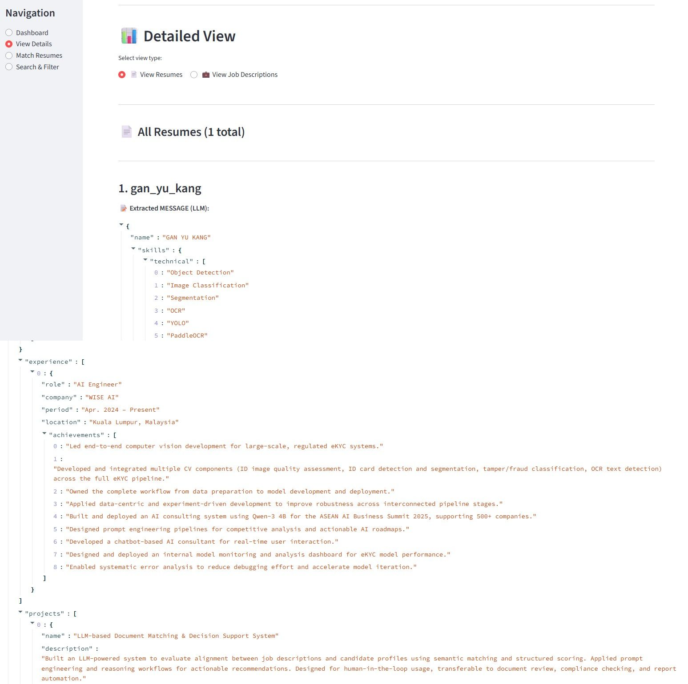
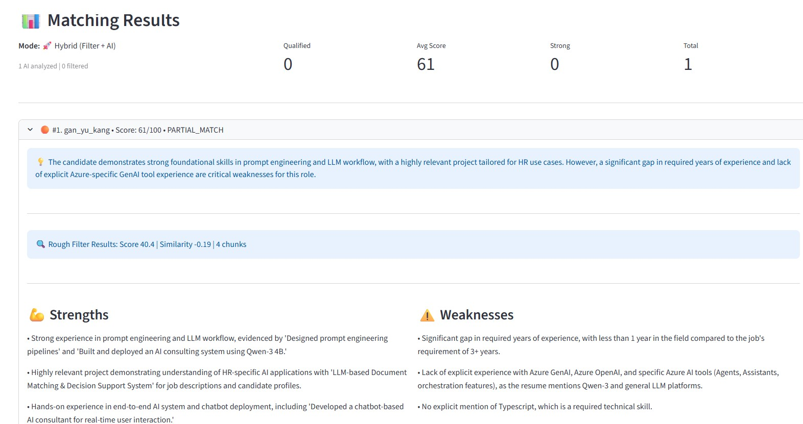

<div align="center">

# AI Resume Manager & Job Matcher

### Intelligent Resume Management and Candidate Matching Powered by AI

[](https://www.python.org/downloads/)
[](https://opensource.org/licenses/MIT)
[](https://streamlit.io)
[](https://www.trychroma.com/)
[](https://ai.google.dev/)

[Features](#features) • [Screenshots](#screenshots) • [Quick Start](#quick-start) • [Usage](#usage) • [Installation](#installation)

</div>

---

## Overview

**Career Copilot** is an advanced AI-powered recruitment assistant that revolutionizes how you manage resumes and match candidates to job openings. Built with cutting-edge technologies like Google Gemini AI, ChromaDB vector database, and Streamlit, it provides intelligent resume parsing, semantic search, and automated candidate ranking.

### Why Career Copilot?

- **Save Time**: Automate resume screening and candidate matching - process 100+ resumes in minutes
- **Improve Quality**: AI-powered analysis ensures better candidate-job fit beyond keyword matching
- **Scale Easily**: Handle hundreds of resumes with batch processing and vector search
- **Data-Driven**: Semantic similarity scores find the best matches, not just keyword matches
- **User-Friendly**: Beautiful web interface - no technical knowledge required
- **Privacy First**: All data stored locally - your candidate data never leaves your machine

## Features

### Core Capabilities

- **Intelligent Resume Parsing**: Extract structured data from PDF resumes using Google Gemini AI
- **Semantic Job Matching**: Find the best candidates using vector similarity, not just keywords
- **Batch Processing**: Upload and process entire folders of resumes at once
- **Interactive Dashboard**: Beautiful Streamlit interface for managing your recruitment pipeline
- **Vector Search**: Powered by ChromaDB for fast and accurate candidate retrieval
- **Resume Analytics**: View detailed breakdowns of skills, experience, and qualifications
- **Persistent Storage**: All data stored locally in a vector database for instant access

---

## Screenshots

### Resume Extraction & Analysis

Upload a resume and instantly see AI-extracted structured data:

<div align="center">
  
  <p><i>AI automatically extracts skills, experience, education, and projects from resumes</i></p>
</div>

### Intelligent Candidate Matching

Match job descriptions with candidates and get detailed scoring:

<div align="center">
  
  <p><i>AI-powered matching with detailed scores and explanations for each candidate</i></p>
</div>

---

## How It Works

Career Copilot uses a 3-step intelligent pipeline:

1. **📥 Extract** → AI parses resumes and job descriptions into structured data
2. **🔍 Store** → Vector embeddings stored in ChromaDB for semantic search
3. **🎯 Match** → Smart matching algorithm ranks candidates by fit, not just keywords

See it in action in the [screenshots above](#screenshots)!

---

## Tech Stack

| Component | Technology |
|-----------|-----------|
| **Frontend** | Streamlit - Beautiful web interface |
| **AI Engine** | Google Gemini - Resume parsing & analysis |
| **Vector DB** | ChromaDB - Semantic search & storage |
| **Embeddings** | Sentence Transformers - Text embeddings |

## Quick Start

```bash
# Clone the repository
git clone https://github.com/gg-kano/carrer_copilot.git
cd carrer_copilot

# Install uv (if you don't have it)
pip install uv

# Install dependencies and create virtual environment
uv sync

# Set up your API key
cp .env.example .env
# Edit .env and add your GOOGLE_API_KEY

# Launch the app
streamlit run app.py
```

Visit `http://localhost:8501` in your browser and start matching candidates!

> **💡 Troubleshooting**: Having API issues? Check the [API Troubleshooting Guide](TROUBLESHOOTING_API.md)

---

## Usage

### Web Interface Workflow

#### 1. Upload Resumes

**Single Upload:**
1. Click on **"📄 Upload Resume"** tab
2. Drag and drop a PDF resume or click **"Browse files"**
3. The AI automatically extracts structured data (see [screenshot](#resume-extraction--analysis)):
   - Candidate name and contact info
   - Skills: technical and soft skills
   - Work experience with achievements
   - Education and certifications
   - Projects and details
4. View the parsed JSON data and verify accuracy

**Batch Upload:**
1. Navigate to **"📁 Batch Upload"** section
2. Enter the folder path containing multiple PDF resumes
3. Click **"Process Folder"**
4. Watch as all resumes are processed automatically

#### 2. Manage Job Descriptions

1. Go to **"💼 Job Description"** tab
2. Paste or type the job description
3. Click **"Analyze Job Description"**
4. AI extracts:
   - Required skills and qualifications
   - Experience level needed
   - Key responsibilities
5. Save the job description for matching

#### 3. Find Perfect Matches

1. Open **"🎯 Match Candidates"** tab
2. Select a job description from the dropdown
3. Set the number of top candidates to display
4. Click **"Find Matches"**
5. View ranked candidates with detailed analysis (see [screenshot](#intelligent-candidate-matching)):
   - **Match Score**: 0-100 percentage based on semantic similarity
   - **Qualification**: Qualified/Not Qualified status
   - **Detailed Reasoning**: AI-generated explanation of why the candidate matches
   - **Strengths**: Top matching skills and experiences
   - **Weaknesses**: Missing skills or gaps
   - **Recommendation**: STRONG_MATCH / GOOD_MATCH / PARTIAL_MATCH / NOT_MATCH

## Project Structure

```
career-copilot/
├── 📄 app.py                          # Main Streamlit application
├── 🗄️ database/
│   └── chroma_db.py                  # ChromaDB vector storage
├── ⚙️ process/
│   ├── resume_process.py             # AI resume parsing
│   └── jd_process.py                 # Job description analysis
├── 🎯 match/
│   └── resume_jd_matcher.py          # Semantic matching engine
├── 🛠️ utils/
│   ├── cache_manager.py              # API response caching
│   ├── chunk_size_manager.py         # LLM context optimization
│   ├── logger.py                     # Logging system
│   └── exceptions.py                 # Custom error handling
├── 💬 prompt/                         # AI prompt templates
├── 📋 .env.example                    # Environment config template
├── 📦 pyproject.toml                  # Project dependencies
├── 📖 README.md                       # Documentation
└── 📜 LICENSE                         # MIT License
```

## Configuration

### Environment Variables

- `GOOGLE_API_KEY`: Your Google Gemini API key (required)

### Database

The application uses ChromaDB for vector storage. Data is persisted in the `chroma_db/` directory.

### Logging

Logs are stored in the `logs/` directory:
- `career_copilot_YYYYMMDD.log`: Application logs
- `errors_YYYYMMDD.log`: Error logs

---

## Documentation

- **[API Troubleshooting Guide](TROUBLESHOOTING_API.md)** - Fix common API quota issues
- **[Matching Improvements](MATCHING_IMPROVEMENTS.md)** - Details on matching enhancements
- **[JD Format Migration](JD_FORMAT_MIGRATION_GUIDE.md)** - Understanding the JD extraction format

---

## Performance

- **Resume Processing**: ~3-5 seconds per resume (with Gemini AI)
- **Batch Upload**: Process 100 resumes in ~5-8 minutes
- **Search Speed**: Instant results from thousands of resumes using vector search
- **Accuracy**: AI-powered semantic matching (not just keyword matching)
- **Daily Capacity**: 1500+ resumes/JDs with free tier API

---

## Use Cases

Career Copilot is perfect for:

- **Recruiters & HR Teams**: Screen hundreds of resumes in minutes, not hours
- **Hiring Managers**: Find the best candidates based on actual requirements, not just keywords
- **Staffing Agencies**: Manage large candidate databases and match them to client needs
- **Job Seekers**: Analyze your resume against job descriptions to improve your chances
- **Small Businesses**: Professional recruitment tools without enterprise costs

---

## License

This project is licensed under the **MIT License** - see the [LICENSE](LICENSE) file for details.

---

## Acknowledgments

Built with amazing open-source technologies:

- **[Google Gemini](https://ai.google.dev/)** - Advanced AI for resume parsing
- **[ChromaDB](https://www.trychroma.com/)** - High-performance vector database
- **[Streamlit](https://streamlit.io/)** - Beautiful Python web framework
- **[Sentence Transformers](https://www.sbert.net/)** - State-of-the-art embeddings

---

<div align="center">

**Made with ❤️ for recruiters and hiring managers**

If you find this helpful, please ⭐ star the repo!

[Report Bug](https://github.com/gg-kano/carrer_copilot/issues) • [Request Feature](https://github.com/gg-kano/carrer_copilot/issues)

</div>
